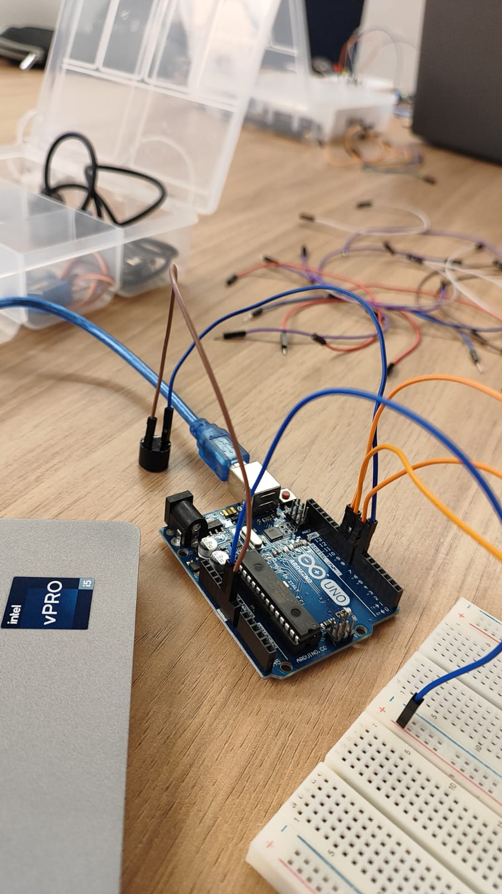

# Protótipo de Semáforo

## **Introdução**

Este projeto é um protótipo de semáforo usando LEDs. Ele simula o funcionamento de um semáforo tradicional, alternando entre os estados de luz verde, amarela e vermelha, com o suporte de um som de alerta emitido por um buzzer em determinados momentos.

## **1. Componentes Utilizados**

| Componente   | Quantidade | Descrição                                          |
|--------------|------------|----------------------------------------------------|
| Arduino      | 1          | Modelo UNO |
| Protoboard   | 1          | Para montagem do circuito                          |
| LEDs         | 3          | Vermelho, amarelo e verde          |
| Buzzer       | 1          | Emite som de alerta                                |
| Resistores   | 3          | Um para cada LED                         |
| Fios jumper  | Vários     | Para as conexões entre componentes e Arduino       |

## **2. Montagem do Circuito**

O circuito completo foi montado segundo a imagem a seguir (repare que o buzzer não está conectado).
<div style="text-align: center;">
    
</div>
Repare aqui que foram utilizados fios brancos para a saída dos LEDs e fios coloridos para a entrada. Foi utilizado um buzzer conectado diretamente no Arduino para indicar um sinal sonoro quando o LED vermelho acender. Foram utilizados resistores para evitar a queima dos LEDs.
<div style="text-align: center;">
    
    
    
</div>

Os componentes foram conectados nas seguintes portas:
    
    - Porta digital 10: LED Vermelho
    - Porta digital 9: LED Amarelo
    - Porta digital 8: LED Verde
    - Porta digital 7: Buzzer

O sistema pode ser visto funcionando nos vídeos a seguir. O primeiro demonstra o buzzer apitando três vezes ao acender o LED verde, visando simular um sinal de pedestres incluindo pedestres com deficiência visual, e o segundo demonstra o semáforo piscando sequencialmente 6s no vermelho, 2s no amarelo, 4s no verde e 2s no amarelo novamente.

https://github.com/user-attachments/assets/b819a026-4567-40c1-ad4a-f59604049d45

https://github.com/user-attachments/assets/61af259d-907e-4da3-afbd-9b798cba1d76

## **3. Código do Arduino**

O código abaixo controla o protótipo do semáforo na IDE do Arduíno.
```c
// definir variáveis
int vermelho = 10;
int amarelo = 9;
int verde = 8;
int buzzer = 7;
 
void setup() {
  // definir pinos do Arduino
  pinMode(vermelho, OUTPUT);
  pinMode(amarelo, OUTPUT);
  pinMode(verde, OUTPUT);
  pinMode(buzzer, OUTPUT);
}
 
void loop() {
  // piscar vermelho por 6s
  digitalWrite(vermelho, HIGH);
  digitalWrite(amarelo, LOW);
  digitalWrite(verde, LOW);
  delay(6000);

  // piscar amarelo por 2s
  digitalWrite(vermelho, LOW);
  digitalWrite(amarelo, HIGH);
  digitalWrite(verde, LOW);
  delay(2000);

  // piscar verde por 2s
  digitalWrite(vermelho, LOW);
  digitalWrite(amarelo, LOW);
  digitalWrite(verde, HIGH);
  delay(2000);

  // ativar buzzer
  for (int i = 0; i < 3; i++) {
      tone(buzzer, 50, 30); // Beep com frequência de 50 Hz por 30 ms
      delay(300);            // Espera 300 ms entre os beeps
  }

  // adicionar tempo adicional no verde por mais 2 segundos
  delay(2000);

  // piscar amarelo por 2s
  digitalWrite(vermelho, LOW);
  digitalWrite(amarelo, HIGH);
  digitalWrite(verde, LOW);
  delay(2000);
}
```
## 4. Template Avaliação Pares

### Avaliador: Matheus Jorge

| Critério  | Contempla (Pontos) | Contempla Parcialmente (Pontos) | Não Contempla (Pontos) | Observações do Avaliador |
|---|---|---|---|---|
| Montagem física com cores corretas, boa disposição dos fios e uso adequado de resistores  | Até 3  | Até 1,5  | 0 | Sistema bem montado  |
| Temporização adequada conforme tempos medidos com auxílio de algum instrumento externo    | Até 3   | Até 1,5 | 0 | Vídeo demonstrando um cronômetro  |
| Código implementa corretamente as fases do semáforo e estrutura do código (variáveis representativas e comentários) | Até 3 | Até 1,5   | 0 |  Código implementa o que foi pedido com a adição de um for loop para ativar o buzzer     |
| Extra: Implementou um componente de liga/desliga no semáforo e/ou usou ponteiros no código | Até 1              |  Até 0,5     | 0    |  Utilizou um buzzer como indicação sonora do LED verde     |
|  |                                         |  |**10**|**Pontuação Total**|

